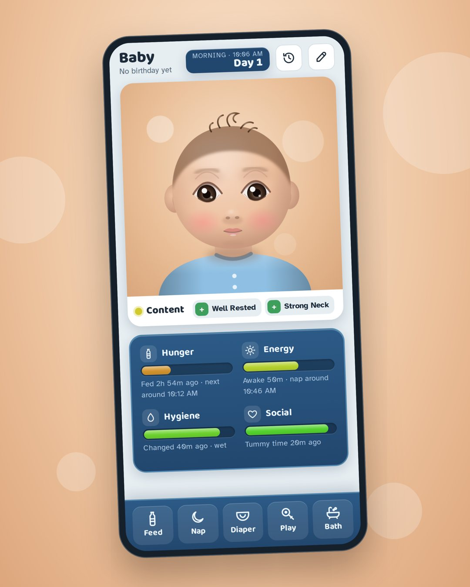
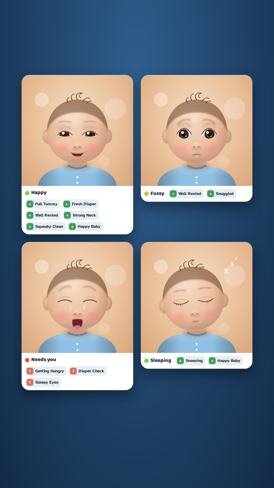
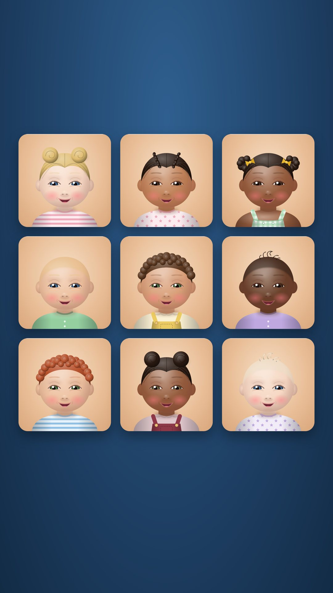
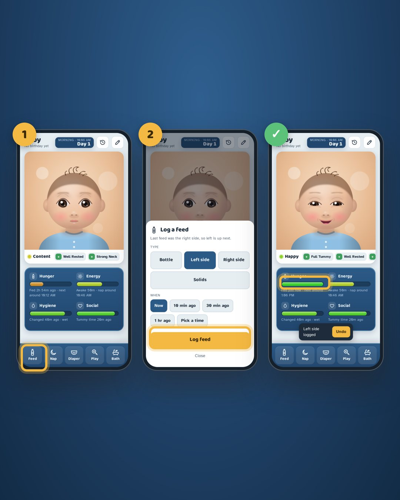

# Just a Baby

Live at **[justababy.ca](https://justababy.ca)**.

A baby tracker that reads like a life-sim game. Instead of charts and forms, you get four needs bars, a mood, a few moodlets, and five big buttons you can hit at 3am.

<p>
  
  
  
</p>

## What it does

- **Needs bars.** Hunger, Energy, Hygiene and Social drain from green to amber based on the time since the last feed, nap, diaper change or play session.
- **Mood and moodlets.** The bars roll up into one mood (Happy, Content, Fussy, Needs you, Sleeping). Moodlets such as *Full Tummy*, *Well Rested* and *Diaper Check* call out what's going on right now.
- **Quick logging.** Feed, Nap, Diaper, Play and Bath are one or two taps each. It remembers which breast side is next and your usual bottle amount. Every log has Undo, and you can backdate it.
- **A portrait of your baby.** You build a shoulders-up portrait from skin tone, hair, eye and outfit options. The face reacts to the mood.
- **History.** Today's totals (feeds, ml, sleep, diapers) and the last 48 hours of entries.



## Running it

It's a static site with no build step.

```sh
git clone https://github.com/Emailfromnaomi/just-a-baby.git
cd just-a-baby
python3 -m http.server 8000   # or any static server
# open http://localhost:8000
```

There are two modes, chosen by [`config.js`](config.js):

| Mode | When | What you get |
|---|---|---|
| **Local** | `config.js` left empty | No accounts, a sample day, entries saved in this browser only. Good for demos and UI work. |
| **Accounts** | Supabase URL and anon key filled in | Email sign-in, your own babies, invite links for caregivers, live sync, offline queue, export and delete. |

To turn on accounts, follow **[SETUP.md](SETUP.md)**. It takes about 20 minutes.

## Files

| File | What it is |
|---|---|
| `index.html` | Markup for the sign-in, add-a-baby and main screens |
| `app.css` | All styles, with light and dark themes |
| `app.js` | The app: need math, portrait, logging, storage, sign-in |
| `config.js` | Supabase URL and anon key (empty = local mode) |
| `supabase/schema.sql` | Tables, row-level security and RPCs. Paste into Supabase once. |
| `supabase/tests/` | Plain-Postgres tests of the access rules |
| `supabase/customerio.sql`, `supabase/functions/cio-sync/` | Sends people and events to Customer.io. See [CUSTOMERIO.md](CUSTOMERIO.md) |
| `privacy.html` | Draft privacy notice (fill in before the beta) |
| `manifest.webmanifest`, `icons/` | Add-to-home-screen support |

## How it works

### Data model

The app stores **events**, not bar values. Each bar is recomputed from timestamps every 30 seconds, so the bars stay correct after the app has been closed overnight.

| Table | Holds |
|---|---|
| `babies` | name, birthday, `settings` (drain intervals, units, sound) and `look` (portrait options) as JSON |
| `baby_members` | who can see a baby: `owner` or `caregiver` |
| `events` | `type` (feed, sleep, diaper, play, bath), `t`, `end_t` (naps), `sub` (bottle, left, wet…), `amount` (ml) |
| `invites` | single-use codes that expire after 7 days |

Every table has row-level security, so a signed-in person only ever reads or writes babies they belong to. Creating a baby, accepting an invite and deleting an account go through `SECURITY DEFINER` functions, so those rules can't be skipped.

### Need math

`decay(elapsed, intervalHours) = clamp(100 − elapsed / interval × 70, 0, 100)`

A bar reaches about 30 when its interval is up (for example, 3 hours after a feed) and bottoms out at about 1.4× the interval. Each need has its own quirk:

- **Energy** counts up from the last wake time. While the baby is asleep, it refills instead.
- **Social** only drains while the baby is awake, because sleep time is subtracted.

Mood is `0.5 × average + 0.5 × lowest`, so one very low bar pulls the mood down. Intervals are per-baby settings, and the birthday suggests typical values by age.

### Sync and offline

- **Writes are optimistic.** The screen updates first, then the change is sent to Supabase.
- **Offline writes are queued.** If the phone is offline, the change goes into an outbox in `localStorage` and is sent in order when it reconnects. The app shows "Saved on this phone" while anything is waiting.
- **Other failures roll back** and show a message.
- **Live updates.** Other caregivers' changes arrive through Supabase Realtime. The app also reloads the log whenever it comes back to the foreground.

## Design notes

- Built for sleep-deprived use: big targets, bottom action bar, no required fields.
- The amber and red zones are deliberately soft. The bars are a guide built from your log, not medical advice.
- Fonts: Baloo 2 (display) and Atkinson Hyperlegible (body), loaded from Google Fonts.
- Light and dark themes follow the system setting.
- The visual language is inspired by life-sim games but is original. Please keep third-party game names, logos and icons out of the app and its marketing.

## Contributing

Open an issue or a pull request. Small, focused PRs are easiest to review.
